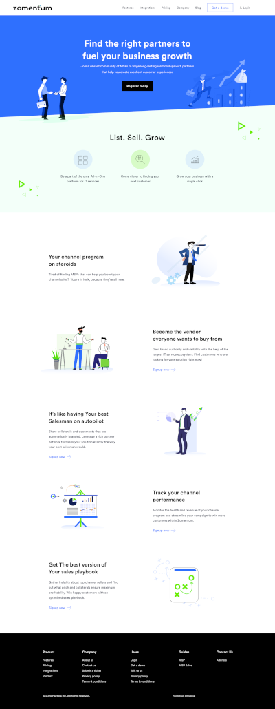

# retro-ingenierie-html
## Maquette sur la base d'une maquette existante
- auteur: Rakesh Mondal
- licence: Creative Common by 4.0
## lien vers la maquette de Rakesh Mondal
[maquette](https://www.figma.com/file/th2vJ1TjJKuoWQ5ZfSZEkM/Landing-Page-for---Zomentum-(Community)?node-id=0%3A1)
## etapes
- Choisir une « Landing Page » version desktop via figma
- réalisé le wireframe et le zoning (outils utilisées: figma, gimp et photoshop)
- zoning et le wireframe version Mobile a partir du desktop (photoshop)
- mockup version mobile (photoshop).
- " intégrez les deux maquettes en mode responsive design en HTML / CSS / Bootstrap et en publiant le code sur Github, sans oublier de créditer l'auteur de la Landing Page, et en choisissant une licence adaptée "

